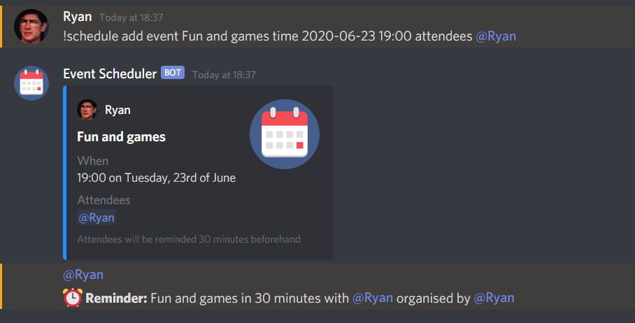

# Discord Scheduler Bot

A self-hosted [disnake](https://github.com/DisnakeDev/disnake) bot written in Python that allows people to schedule simple events in their Discord server and have the attendees mentioned when the event is about to begin.

## Installation

1. Clone this repository using `git clone https://github.com/rpower/discord-scheduler-bot`
2. Install required packages using `pip install -r requirements.txt`
3. Create two environment variables:
   1. `BOT_TOKEN` - containing the API token for your Discord bot
   2. `AVATAR_URL` - a URL containing the avatar image you want to use for your bot's posts

## Commands

All messages to the bot should start with `!schedule`, a space, and then the appropriate command:

Command | Description | Example
--- | --- | ---
`help` | List all the commands available | `!schedule help`
`add` | Create a new event | `!schedule add event event_name time YYYY-MM-DD HH:MM attendees attendees_list`
`delete` | Delete an event | `!schedule delete event_id`
`list` | Get a list of all upcoming events and IDs | `!schedule list`

* `event_name` should be the name of the event you are creating
* `YYYY-MM-DD HH:MM` should be the date and 24 hour time of the event you are creating
* `attendees_list` should be the people attending the event (you can use the `@user_name` Discord format here as well)
* `event_id` is the ID associated with the event and can be found using the `!schedule list` command

By default events are created with a 30 minute reminder, but that can be changed by adding an optional `reminder reminder_time` to the end of the `add` command, where `reminder_time` is the desired reminder window in minutes.

**Example:**

Creating an event on New Years Day at 2pm with a reminder 5 minutes beforehand:

`!schedule add event Celebrating New Years Day time 2021-01-01 14:00 attendees @my_friend1 @my_friend2 @my_friend3 reminder 5`

#### Other notes:

* The `list` command will only show upcoming events
* The `delete` command can only be used by the person who created the event **or** users with admin rights in a server
* This server only works in UK time for the time being
* Adding yourself as an attendee when using the `add` command is optional, you will be reminded either way